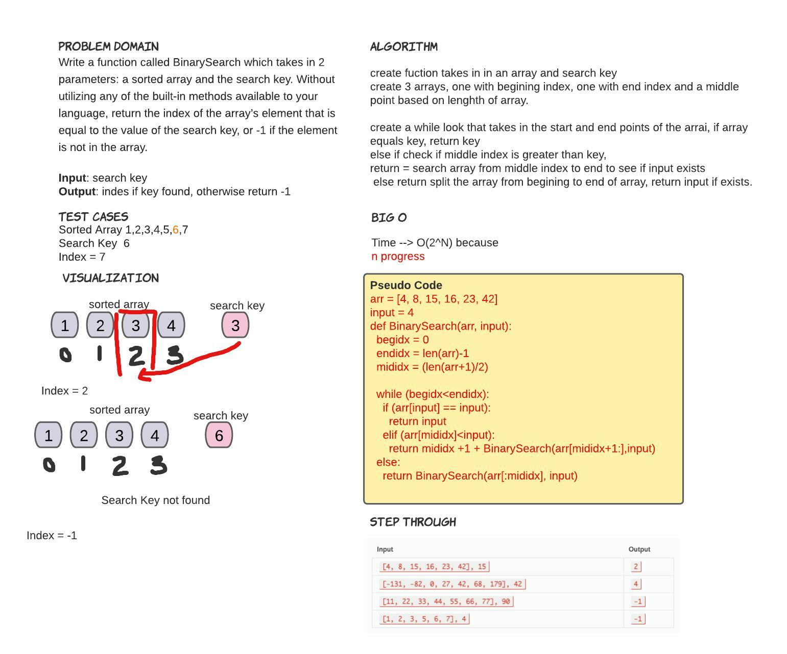

# Binary Search of Sorted Array
<!-- Description of the challenge -->
Write a function called BinarySearch which takes in 2 parameters: a sorted array and the search key. Without utilizing any of the built-in methods available to your language, return the index of the array’s element that is equal to the value of the search key, or -1 if the element is not in the array.

## Whiteboard Process
<!-- Embedded whiteboard image -->

## Approach & Efficiency
<!-- What approach did you take? Discuss Why. What is the Big O space/time for this approach? -->

I started with basic for loop and realized that this formula would be more complex. I re-read the directions a few times before I realized what was being asked. I unfortunately could not wrap my head around the concept fully.

I used a formula found: https://stackoverflow.com/questions/38346013/binary-search-in-a-python-list

which seems like it would work but i didnt have sucess in testing.

The Big O Space/time
Space: O(N) because it will grow only in relation to the input used to search the array.
Time: O(N²) because it will always use time based on size of list.
