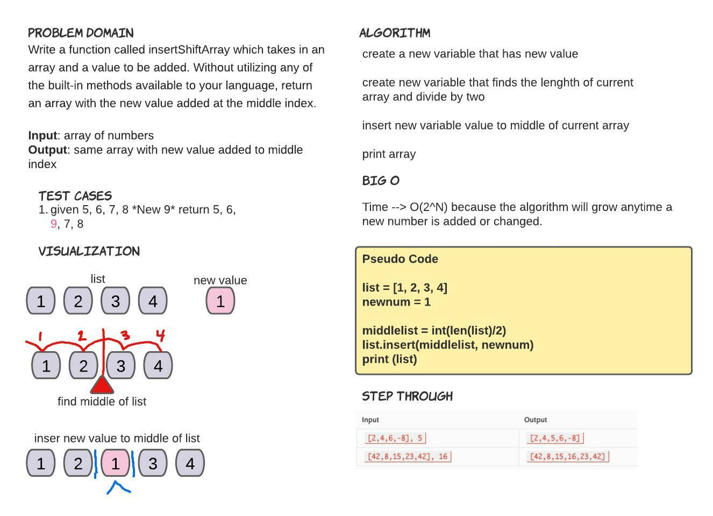

# Insert to Middle of an Array
Write a function called insertShiftArray which takes in an array and a value to be added. Without utilizing any of the built-in methods available to your language, return an array with the new value added at the middle index.

## Whiteboard Process
<!-- Embedded whiteboard image -->

## Approach & Efficiency
<!-- What approach did you take? Discuss Why. What is the Big O space/time for this approach? -->

Im still learning how to write code that I come up with. So this was hard for me to wrap my head around. I went back to my solo learning and found an vanilla way of writing the code that could initially get the job done. I used **len** to find the lenghth of the array and then divided it by two. Then on the same method I used **int** to convert it to a whole number. Finally I used the **insert** method to change the original array and insert the new value to the middle of the array.
