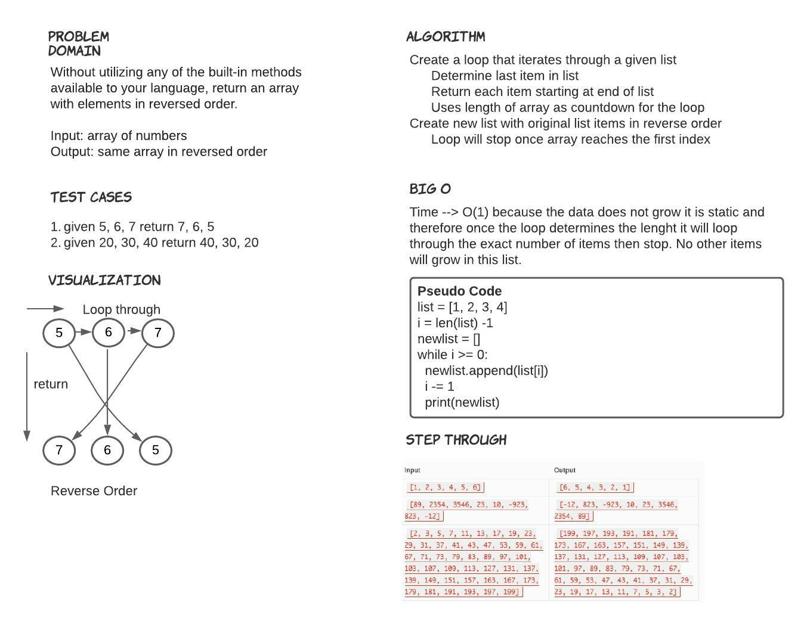

# Reverse an Array
take an array and reverse the output of the array

## Whiteboard Process

## Approach & Efficiency
I took the approach of the for loop since this is simple and ive had practice with it before.
