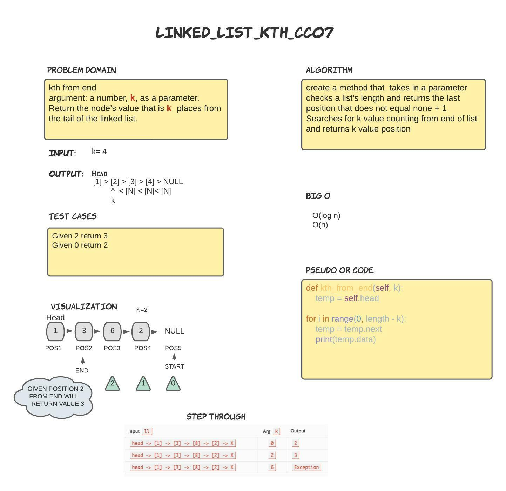

## Lab07- Linked List kth

---

# Challenge Summary
<!-- Description of the challenge -->

Write the following method for the Linked List class:

**kth from end** 
-argument: a number, k, as a parameter. 
-Return the node’s value that is k places from the tail of the linked list. 
-You have access to the Node class and all the properties on the Linked List class as well as the methods created in previous challenges. 

## Whiteboard Process
<!-- Embedded whiteboard image -->

## Approach & Efficiency
<!-- What approach did you take? Why? What is the Big O space/time for this approach? -->

## Solution
<!-- Show how to run your code, and examples of it in action -->

With the Help of google
https://www.geeksforgeeks.org/nth-node-from-the-end-of-a-linked-list/

create a method that  takes in a parameter
checks a list's length and returns the last position that does not equal none + 1
Searches for k value counting from end of list and returns k value position

