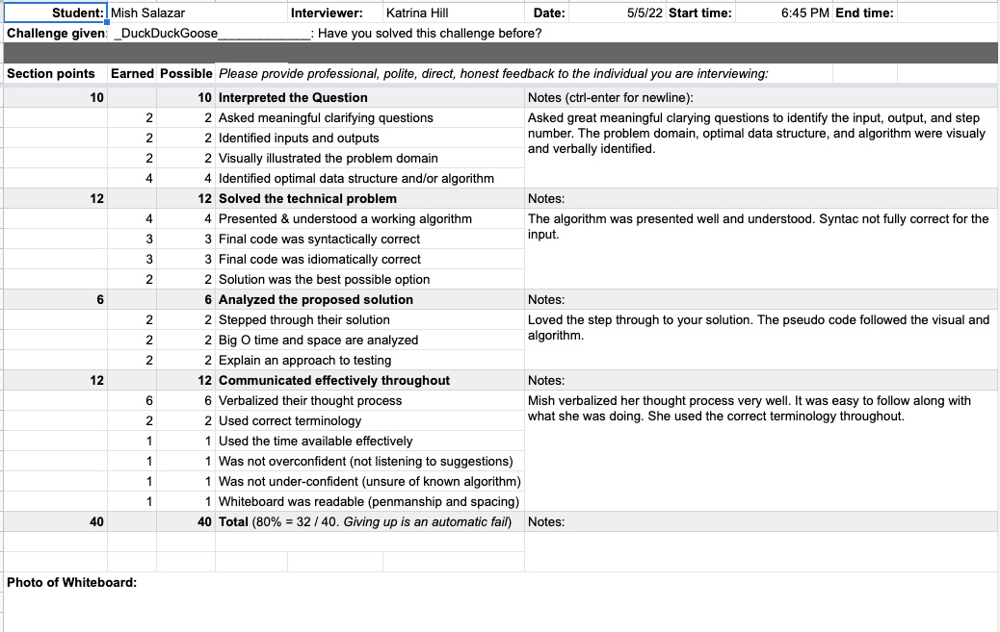

Code Challenge 14 - Mock interview
Interviewer Katrina Hill, Ella Svete

# Challenge Summary
<!-- Description of the challenge -->
Write a function calledDuckDuckGoose()that accepts some strings and an int k. Start at the beginning and count up to k and remove the person at that position. Keep counting from that index and count up to k over and over until only one person is left. Return a string with the name of the last person left.

## Whiteboard Process
<!-- Embedded whiteboard image -->

## Approach & Efficiency
<!-- What approach did you take? Why? What is the Big O space/time for this approach? -->

## Solution
<!-- Show how to run your code, and examples of it in action -->

