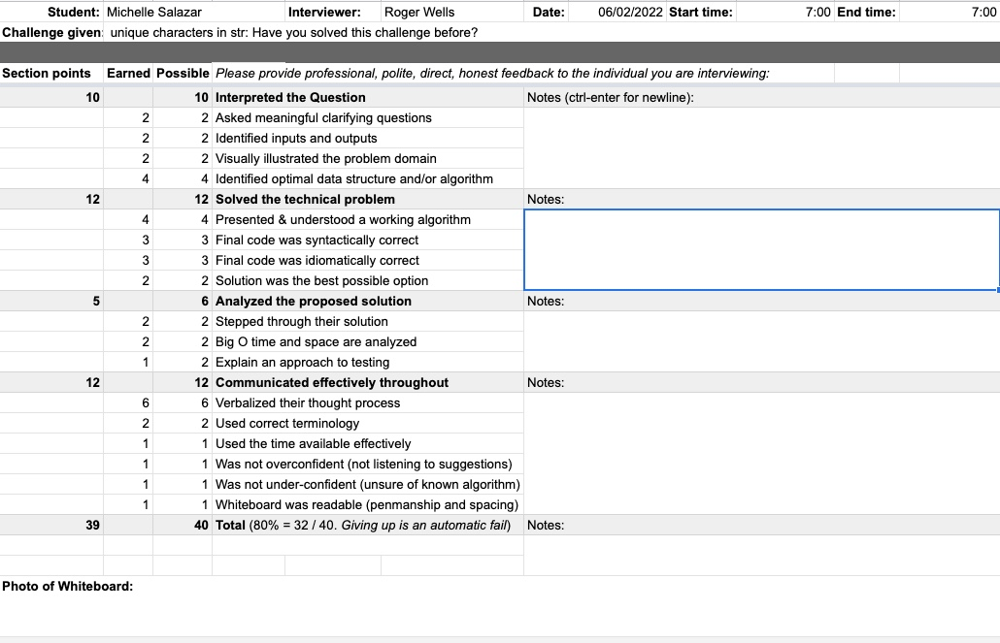
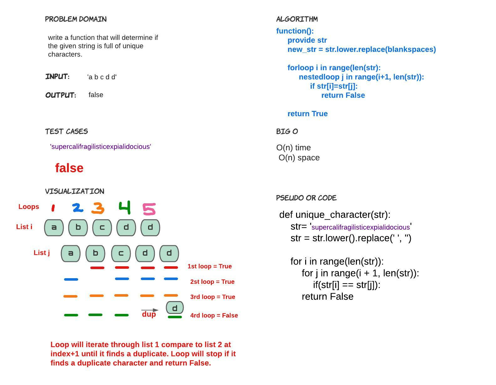

Code Challenge 34 - Mock interview
Interviewer Roger Wells

# Challenge Summary
<!-- Description of the challenge -->
Interview2

Ask the candidate to write a function that will determine if the given string is full of unique characters.
We can assume that spaces don’t count, and the charactes are not case sensitive (i.e. “A” is the same as “a”).
The most efficient solution is going to use a Hashmap. The candidate should iterate through the string and for each of the characters put them in the Hashset, if the value already exists, they can return false as soon as a duplicate occurs.
We can assume they have a Hashset readily available (they do not have to implement one)
This solution is of an O(n) time and O(n) space

## Whiteboard Process
<!-- Embedded whiteboard image -->

## Approach & Efficiency
<!-- What approach did you take? Why? What is the Big O space/time for this approach? -->

## Solution
<!-- Show how to run your code, and examples of it in action -->

